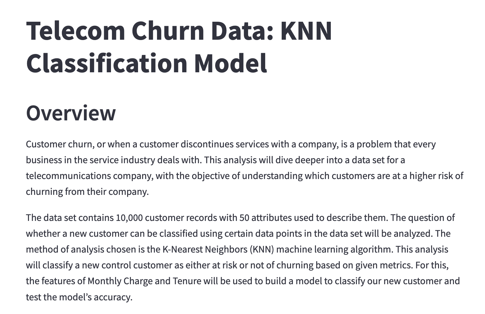
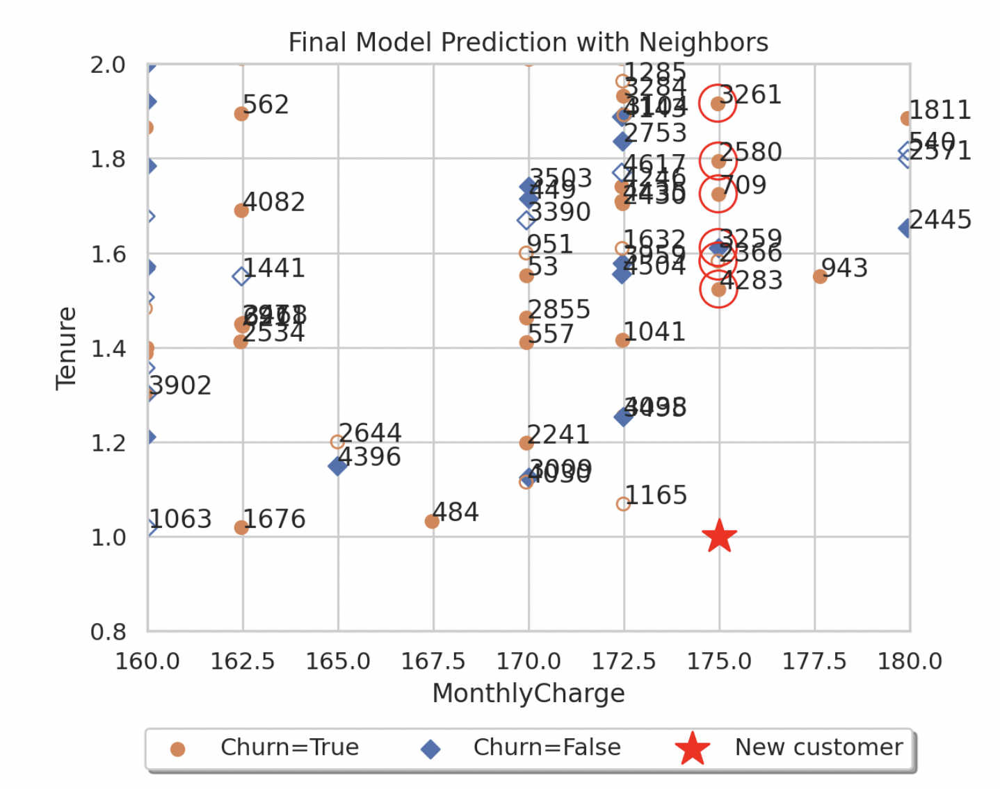

# Churn KNN classifier

## Maintainer:
data.is4life@gmail.com

### Summary: 

Churn classification model using K-Nearest Neighbor analysis. Dockerized streamlit app written using Python 3.9.16 slim buster image.  
The KNN model is built using Scikit Learn's KNeighborsClassifier and analyzed using plots constructed with Matplotlib and Seaborn.  
The data is an ingested csv file with telecommunication customer data and a churn variable detailing if the customer has churned in the past 12 months from the provider. 

### Instructions:

With Docker running, use this code to build the docker image.  

docker build -t churn_knn:v1 .  

Once the image is constructed, run this code to run the image and view the app.  

docker run -d -p 8501:8501 churn-knn:v1 

### Final Prediction:

The code cleans the data file, wrangles the categorical variables into numeric values, builds and tunes the model. A new customeer parameter is defined and the model produces the chart shown as the final output.  

